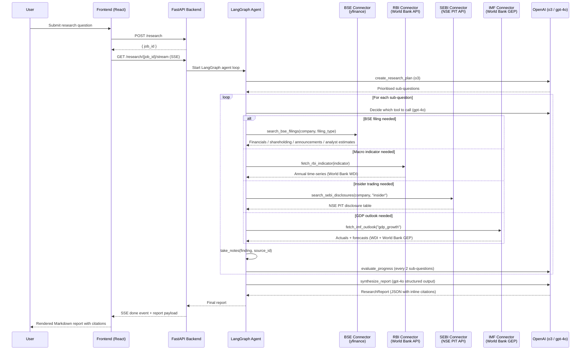

# India Finance Deep Researcher

An agentic deep-research tool that answers questions about Indian listed companies and
macroeconomics. Ask a question in plain English; the agent autonomously pulls data from
live sources, synthesises findings, and produces a structured Markdown report with inline citations.

---

## How It Works



---

## Data Sources

| Connector | Underlying API | What it returns | Limitation |
|-----------|---------------|-----------------|------------|
| **BSE** (`search_bse_filings`) | yfinance (Yahoo Finance) | Quarterly P&L, shareholding, events/news, analyst estimates | Annual reports not available; sparse data for some newer companies |
| **RBI** (`fetch_rbi_indicator`) | World Bank Dev. Indicators | CPI, GDP growth, NPA ratio, repo rate proxy, forex reserves, bank credit, WPI proxy | Annual frequency only; lags current year by ~6–12 months |
| **SEBI** (`search_sebi_disclosures`) | NSE PIT API | Insider buy/sell transactions (PIT disclosures) | SAST and pledge disclosures unavailable (returns guidance message) |
| **IMF** (`fetch_imf_outlook`) | World Bank WDI + GEP (source=27) | India GDP growth — historical actuals + 2–3yr forward forecasts | Only `gdp_growth` has live projections; other indicators return guidance message |

### BSE filing types

`results` · `shareholding` · `announcements` · `estimates`

> `estimates` returns analyst consensus EPS/revenue forecasts, growth rates, price targets, and buy/hold/sell recommendation counts. Treat as market expectations, not reported data.

### Available RBI indicators

`repo_rate` · `cpi` · `wpi` · `bank_credit_growth` · `bank_deposits` · `forex_reserves` · `npa_ratio` · `gdp_growth`

### What is NOT available

- P/E, P/B ratios, ROE, ROCE, Debt/Equity
- Real-time or intraday price data
- Annual report PDFs
- SAST / pledge disclosures
- Monthly or quarterly macro data (all macro sources are annual frequency)
- IMF projections for inflation, fiscal balance, current account (IMF API is blocked; only GDP growth has a working alternative via World Bank GEP)

---

## Stack

**Backend:** FastAPI + LangGraph · Python 3.11+ · `httpx` · `yfinance` · `aiosqlite` (SQLite job state) · `structlog`

**LLM:** OpenAI — `o3` for research planning · `gpt-4o` for agent loop, evaluation, and synthesis

**Frontend:** React 18 + TypeScript · Vite · Tailwind CSS · TanStack Query · Zustand

---

## Prerequisites

- Python 3.11+
- Node.js 18+
- An OpenAI API key with access to `o3` and `gpt-4o`

---

## Setup

### 1. Clone the repo

```bash
git clone https://github.com/srinivas-sateesh/India-Finance-Deep-Researcher.git
cd India-Finance-Deep-Researcher
```

### 2. Fill in your keys

```bash
cd backend
cp .env.example .env
```

Open `backend/.env` and set your keys — only `OPENAI_API_KEY` is required to run:

```
OPENAI_API_KEY=sk-...          # required — needs access to o3 and gpt-4o
LANGCHAIN_API_KEY=ls__...      # optional — only if you want LangSmith tracing
```

Everything else in `.env` (ports, model names, source URLs) has sensible defaults and can be left as-is.

### 3. Install backend dependencies

```bash
# Using pip
python -m venv .venv
source .venv/bin/activate          # Windows: .venv\Scripts\activate
pip install -r requirements.txt

# Or using uv (faster)
uv venv --python 3.11 && uv pip install -r requirements.txt
```

### 4. Install frontend dependencies

```bash
cd ../frontend
npm install
```

---

## Configuration

### Backend — `backend/.env`

| Variable | Default | Description |
|----------|---------|-------------|
| `OPENAI_API_KEY` | *(required)* | OpenAI key with access to `o3` and `gpt-4o` |
| `LANGCHAIN_API_KEY` | *(optional)* | LangSmith tracing key — set `LANGCHAIN_TRACING_V2=true` to enable |
| `LANGCHAIN_TRACING_V2` | `false` | Enable LangSmith trace logging |
| `LANGCHAIN_PROJECT` | `india-finance-deep-researcher` | LangSmith project name |
| `BACKEND_PORT` | `8001` | Port the FastAPI server listens on |
| `PLANNER_MODEL` | `o3` | Model for research planning (question decomposition) |
| `EVALUATOR_MODEL` | `gpt-4o` | Model for evaluating research progress |
| `CONNECTOR_TIMEOUT` | `30` | HTTP timeout in seconds for all connector requests |
| `CONNECTOR_RETRIES` | `5` | Max retry attempts on 429/5xx (exponential backoff) |
| `WORLDBANK_API_BASE` | `https://api.worldbank.org/v2/country/IN/indicator` | World Bank API base URL — used by both RBI connector (historical macro) and IMF connector (GDP growth forecasts via GEP source=27) |
| `NSE_BASE_URL` | `https://www.nseindia.com` | NSE base URL (SEBI insider trading) |
| `YAHOO_SEARCH_URL` | `https://query2.finance.yahoo.com/v1/finance/search` | Yahoo Finance ticker search (BSE connector) |

> **Note:** The agent-loop model (`graph.py`) and synthesizer model (`synthesize.py`) are hardcoded as `gpt-4o` in copied files — change them directly in code if needed.

### Frontend — `frontend/.env`

| Variable | Default | Description |
|----------|---------|-------------|
| `FRONTEND_PORT` | `5173` | Port the Vite dev server listens on |
| `BACKEND_URL` | `http://localhost:8001` | Backend URL for the Vite proxy — must match `BACKEND_PORT` if changed |

---

## Running Locally

Open two terminals.

**Terminal 1 — Backend**

```bash
cd backend
source .venv/bin/activate
python api.py          # reads BACKEND_PORT from .env, defaults to 8001
```

Or pass the port directly via uvicorn:

```bash
uvicorn api:app --host 0.0.0.0 --port 8001 --reload
```

**Terminal 2 — Frontend**

```bash
cd frontend
npm run dev            # reads FRONTEND_PORT and BACKEND_URL from .env
```

Open [http://localhost:5173](http://localhost:5173) in your browser (or your configured `FRONTEND_PORT`).

The Vite dev server proxies all `/research` requests to the backend automatically.

---

## API Reference

The backend is also usable directly without the frontend.

```bash
# Submit a research job
curl -X POST http://localhost:8001/research \
  -H "Content-Type: application/json" \
  -d '{"question": "What has been HDFC Bank net income trend over the last 6 quarters?"}'
# → {"job_id": "abc123"}

# Stream live progress (Server-Sent Events)
curl http://localhost:8001/research/abc123/stream

# Check job status
curl http://localhost:8001/research/abc123

# Fetch completed report
curl http://localhost:8001/research/abc123/result

# Download as PDF
curl http://localhost:8001/research/abc123/pdf -o report.pdf

# List all jobs
curl http://localhost:8001/research
```

---

## Example Questions

### Single-source (fast, ~3–5 min)

- *"Review TCS's last 8 quarters of revenue, operating income, and EPS. Is earnings growth accelerating or decelerating?"*
- *"Has institutional ownership in Infosys increased or decreased over the last 6 quarters?"*
- *"Describe India's GDP growth and CPI inflation arc from 2019 to 2024. Identify the two periods of greatest stress."*
- *"Summarise all insider trading activity at Infosys over the last 12 months. Are executives net buyers or sellers?"*

### Multi-source (richer analysis, ~8–15 min)

- *"India's lending rates rose from 2022 to 2024. How did HDFC Bank's net interest income respond? Did the bank benefit or face margin compression?"*
- *"CPI inflation peaked in 2022. Which quarters of Nestle India's results showed the sharpest gross profit compression, and how quickly did margins recover?"*
- *"Paytm has reported narrowing losses over the last 6 quarters. Are insiders buying or selling? Does insider behaviour confirm the improving financial story?"*
- *"Provide a 360° view of ICICI Bank: earnings trajectory, institutional ownership trend, insider activity, and how the RBI NPA backdrop contextualises its asset quality claims."*

### Forward-looking (analyst estimates + GDP projections)

Two data sources power forward-looking questions:

**Analyst consensus** (`search_bse_filings(..., "estimates")`) — EPS and revenue estimates for next 1–2 quarters and full year, 5-year EPS growth forecasts, price targets (low/mean/high), and buy/hold/sell recommendation counts. Best for large-caps; mid-cap quarterly coverage can be sparse.

- *"What do analysts expect TCS to earn (EPS and revenue) in the next two quarters? Is the consensus optimistic vs the recent run rate?"*
- *"How many analysts cover HDFC Bank and what is the buy/hold/sell split? What does the price target range say about conviction?"*
- *"Bajaj Finance has been growing fast. What growth rate are analysts projecting for next year, and how does that compare to the last 4 quarters?"*
- *"Are Infosys analysts more bullish or bearish than 3 months ago — has the recommendation mix shifted?"*

**India GDP growth outlook** (`fetch_imf_outlook("gdp_growth")`) — historical actuals (2018–2024) plus World Bank GEP preliminary and 2–3 year forecasts, each row tagged `[actual]`, `[prelim.]`, or `[forecast]`.

- *"What does the World Bank project for India's GDP growth through 2027? Is the trajectory accelerating or moderating?"*
- *"India contracted in 2020 and rebounded sharply. Does the current growth projection suggest a return to pre-COVID trend levels?"*

**Best combined questions** — pairing projections with historical data or insider signals:

- *"What do analysts project for HDFC Bank EPS over the next year? Given the RBI rate cycle history and the bank's actual NIM performance, is the consensus realistic?"*
- *"TCS analyst estimates show +6% EPS growth next year. The World Bank projects India GDP at 6.5% — does the macro backdrop support or undercut that estimate?"*
- *"Infosys insiders have been selling. Meanwhile analysts have a mean price target 34% above current price. Is insider behaviour contradicting analyst optimism?"*

**What cannot be asked about the future** — inflation projections, fiscal deficit outlook, current account, sector-level forecasts, and management guidance are not available (IMF API is blocked; no free alternative found for non-GDP indicators).

---

## Project Structure

```
.
├── backend/
│   ├── api.py                        ← FastAPI app entrypoint (uvicorn target)
│   ├── requirements.txt
│   ├── .env.example
│   └── app/
│       ├── agents/
│       │   ├── graph.py              ← LangGraph agent loop
│       │   ├── state.py              ← ResearchState, Note, SubQuestion
│       │   ├── tools.py              ← 7 tools: plan + 4 connectors + notes + eval
│       │   └── utils.py              ← LLM retry helpers
│       ├── connectors/
│       │   ├── __init__.py           ← shared _fetch() retry helper
│       │   ├── bse.py                ← yfinance (results/shareholding/announcements/estimates)
│       │   ├── rbi.py                ← World Bank WDI (macro indicators, historical)
│       │   ├── sebi.py               ← NSE PIT API (insider trading)
│       │   └── imf.py                ← World Bank WDI + GEP (GDP growth actuals + forecasts)
│       ├── api/
│       │   └── routes.py             ← REST endpoints + SSE broadcaster
│       └── llm/
│           ├── synthesize.py         ← report synthesis + PDF render
│           └── prompts/
│               ├── system.py         ← agent system prompt
│               ├── planning.py       ← research planning prompt
│               ├── evaluation.py     ← progress evaluation prompt
│               └── synthesis.py      ← report synthesis prompt
└── frontend/
    └── src/
        ├── components/               ← UI components
        ├── hooks/                    ← TanStack Query + SSE hooks
        ├── pages/                    ← page-level components
        └── types/                    ← TypeScript interfaces mirroring backend models
```

---

## Source Citation Format

Every numerical claim in the report is cited inline. Format:

| Source | Example citation |
|--------|-----------------|
| BSE quarterly results | `[BSE:HDFCBANK.NS:results]` |
| BSE shareholding | `[BSE:INFY.NS:shareholding]` |
| BSE announcements | `[BSE:TCS.NS:announcements]` |
| BSE analyst estimates | `[BSE:TCS.NS:estimates]` |
| RBI / World Bank macro | `[RBI:npa_ratio]`, `[RBI:cpi]` |
| SEBI insider trading | `[SEBI:Infosys:insider]` |
| GDP growth outlook | `[IMF:gdp_growth]` |

---

## Disclaimer

This application is intended for informational and research purposes only. The reports generated are based on publicly available data and analyst consensus, and may contain errors, omissions, or outdated information.

**Nothing in this application constitutes financial, investment, legal, or tax advice.** Do not buy, sell, or hold any security based solely on the output of this tool.

The author and contributors of this project accept no responsibility or liability for any financial loss, damage, or other consequences — direct or indirect — arising from the use of, or reliance on, information produced by this application. Users are solely responsible for their own investment decisions and are strongly advised to consult a qualified financial advisor before acting on any information.
